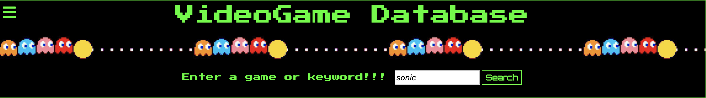
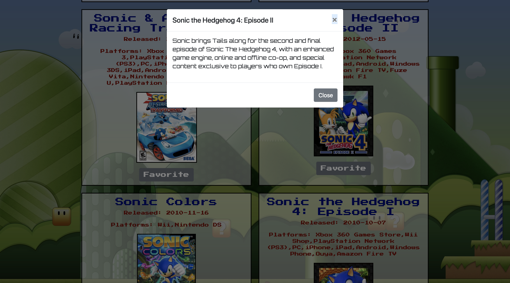
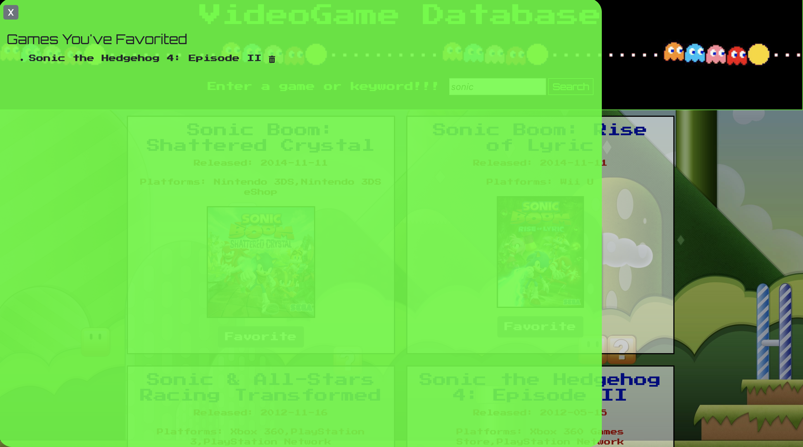

# Q1-VideoGame Database

A database to search for games and game series.

## Table of Contents

- [Usage](#usage)
- [Support](#support)

## Usage

Open http://VGDB.surge.sh

Search for a game by

- Entering either a game or a keyword into the search bar:
- Click "search"

You will see your results pop up on the page, once there

- Click on the title for a game to view a brief description of the game :

- You can add a game to your list of favorites by clicking the "favorite" button under each game image :

- To "Un" favorite a game, simply click the trashcan icon next to each game

## Support

Please [open an issue](https://github.com/burnsidion/Q1-Project/issues) for support.
